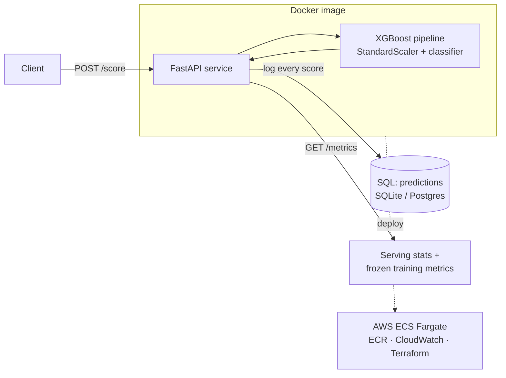

# Real-Time Fraud-Scoring Service

A production-style machine-learning microservice that scores transactions for fraud in
real time. Built to demonstrate the **full ML-engineering lifecycle** — not just a model
in a notebook, but a trained, tested, containerized, and cloud-deployable service.

> **Problem shape:** extreme class imbalance (~0.4% fraud). The interesting engineering is
> handling that imbalance honestly (cost-weighted thresholding, precision/recall trade-offs)
> and wrapping the model in a system that can be monitored and redeployed.

  

## Architecture



## What it demonstrates

| Area | In this repo |
|---|---|
| **ML modeling** | XGBoost on an imbalanced problem; `scale_pos_weight`, stratified splits, cost-weighted F-beta threshold tuning on a held-out validation set |
| **No train/serve skew** | Preprocessing + model in one `sklearn.Pipeline`, saved as a single artifact |
| **Serving** | FastAPI with pydantic request validation (`extra="forbid"`), health/metrics endpoints, batch scoring |
| **Data layer** | Every prediction logged to SQL (SQLAlchemy) — the basis for monitoring & drift |
| **Testing** | `pytest` covering the training pipeline and the API (in-process `TestClient`) |
| **Containerization** | Multi-stage Dockerfile, non-root user, healthcheck; `docker-compose` with Postgres |
| **CI** | GitHub Actions: lint → train → test → build image |
| **IaC / cloud** | Terraform for ECR + ECS Fargate + CloudWatch; step-by-step `infra/DEPLOY.md` |

## Quickstart

```bash
pip install -r requirements.txt
python -m src.train                 # trains on a synthetic stand-in; writes models/model.joblib
uvicorn src.api:app --reload        # serve at http://localhost:8000  (/docs for Swagger UI)
```

Score a transaction:

```bash
curl -s localhost:8000/score -H 'content-type: application/json' \
  -d "$(python -c 'from src.data import make_synthetic,FEATURE_COLUMNS as F; r=make_synthetic(1000).iloc[0]; import json; print(json.dumps({c:float(r[c]) for c in F}))')"
# -> {"fraud_probability": 0.01, "is_fraud": false, "threshold": 0.05, "model_version": "..."}
```

Or run the whole prod-like stack (API + Postgres):

```bash
docker compose up --build
```

## Results

Trained and evaluated on the Kaggle Credit Card Fraud dataset (284,807 transactions, 0.17%
fraud). Metrics on a held-out test set the threshold tuner never saw:

| Metric | Random split | Time-based split |
|---|---|---|
| ROC-AUC | 0.978 | 0.973 |
| Average precision (PR-AUC) | 0.87 | 0.80 |
| Precision @ tuned threshold | 0.86 | 0.89 |
| Recall @ tuned threshold | 0.84 | 0.75 |
| Positive rate | 0.17% | 0.17% |

> The **time-based split** (`--split temporal`) trains on earlier transactions and tests on
> later ones, avoiding temporal leakage — the more honest number. The repo also runs fully
> offline on a synthetic stand-in when `data/creditcard.csv` is absent. To use the real data,
> download the [Kaggle Credit Card Fraud dataset](https://www.kaggle.com/mlg-ulb/creditcardfraud),
> drop `creditcard.csv` into `data/`, and run `python -m src.train` (add `--split temporal`,
> `--search`, or `--calibrate` for the rigorous variants).

## API

| Method | Path | Purpose |
|---|---|---|
| GET | `/health` | Liveness + whether the model is loaded |
| GET | `/metrics` | Serving stats + frozen training metrics |
| POST | `/score` | Score one transaction |
| POST | `/score/batch` | Score many |

Interactive docs at `/docs` (Swagger) and `/redoc`.

## Project structure

```
src/        config · data · train · schema · db · api   (the service)
scripts/    explain_model.py — model interpretability charts
tests/      pytest suite (pipeline + API)
docker/     multi-stage Dockerfile
infra/      Terraform (ECR + ECS Fargate) + DEPLOY.md
.github/    CI workflow
```

## Deployment

See [`infra/DEPLOY.md`](infra/DEPLOY.md) for the full AWS path (ECR push → Terraform apply →
ECS rollout) and the production-hardening checklist (ALB + TLS, RDS Postgres, model-in-S3,
autoscaling).

## License

MIT
